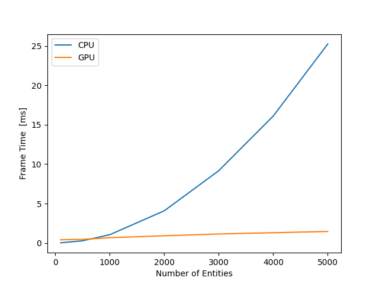
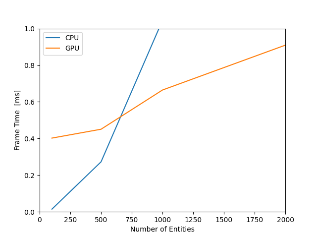

# Bitmap Collision with GPU Experiment

## What is this?

GPUを用いて描画したビットマップを用いた衝突判定のパフォーマンスを実験するプログラム。

グラフィックスAPIにDirect3D12を用いる。

## Build & Run

Visual Studio 2022で良しなにビルドしてください。

実行する場合は、カレントディレクトリに次を置いてください：

- [circle.png](./img/circle.png)
- ps.cso (ビルド時に生成される)
- vs.cso (ビルド時に生成される)

## Result

### 全体

### 部分

